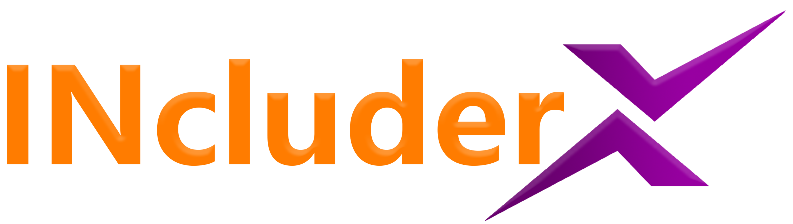
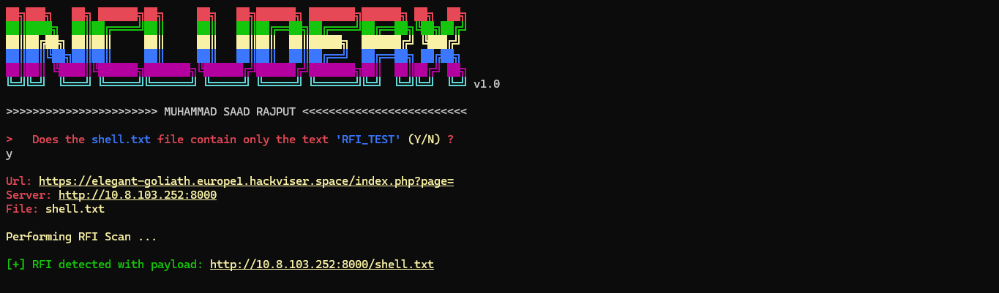

# Hi I am Muhammad Saad

## 🌐 Socials:
[](https://discord.gg/https://discord.gg/HrJ6jkXe) [](https://linkedin.com/in/muhammad-saad-9818502b3) [](https://medium.com/@@shaheeri8330) [](https://reddit.com/user/Annual-Jeweler1462) [](mailto:shaheeri8330@gmail.com) 

# 💻 Tech Stack:
                        

# 💫 About Me:
🛠️ I’m currently working on: Red Teaming operations, offensive security tooling, and vulnerability research.<br>🤝 I’m looking to collaborate on: Advanced red teaming tools and controlled malware research (for security testing).<br>💡 I’m looking for help with: Scaling high-performance security tools (async, multithreading).<br>📚 I’m currently learning: Computer Science, diving deep into Cybersecurity, Red Teaming, and low-level exploitation.<br>

# ⚡INcluderX:
A high-performance RFI/LFI vulnerability scanner for bug bounty hunters and web security testing, enhanced by INcluderX for intelligent payload injection, deep fuzzing, and accurate vulnerability validation.



# 🚀 Features of INcluderX:
⚡ High-performance RFI & LFI scanning engine  
🎯 Accurate vulnerability detection with low false positives  
🧠 Intelligent payload generation (INcluderX core engine)  
🔄 Advanced payload mutation & filter bypass techniques  
📂 Custom wordlist support for targeted fuzzing  
🚀 Asynchronous & multi-threaded scanning for maximum speed  
🔍 Deep fuzzing for hidden file inclusion vulnerabilities  
🛡️ Built-in detection signatures (e.g., `/etc/passwd`, config leaks)  
⛔ Instant scan interruption using CTRL+C  
📊 Clean, readable output using Rich UI  
🔌 Modular design for easy extension & integration  

# ⚙️ Installation & Usage Guide

## 📥 Installation

Clone the repository:

```bash
git clone https://github.com/msaadraj/INcluderX
cd INcluderX
pip install -r requirements.txt
chmod +x INcluderX.py
```

# 🚀 Usage
## 🔍 LFI Scan

```bash
./INcluderX.py lfi -u <target_url> -w <wordlist>
```
## 🌐 RFI Scan

```bash
./INcluderX.py rfi -u <target_url> -s <server> -f <file>
```

# 📸 Screenshots

## 🛠️ Help Menu
<p align="center">
  
</p>

## 🌐 RFI Scan
<p align="center">
  
</p>

# 📊 GitHub Stats:
<br/>
<br/>


